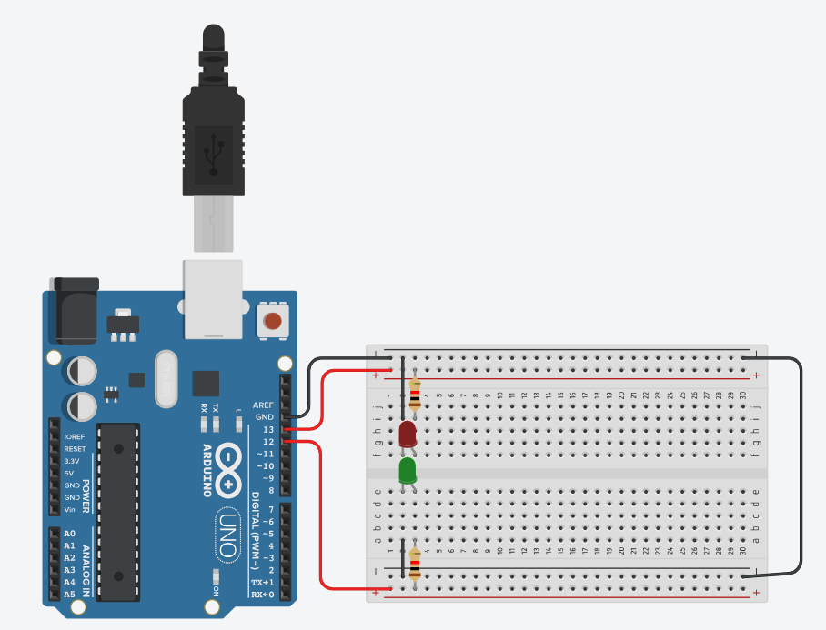

# Projeto Arduíno para manipular 2 LEDs em paralelo

## Contextualização

Neste experimento faremos  com que o LED incorporado e dois LEDs pisquem alternadamente utilizando o pino digital 13 (pino digital incorporado LED_BUILTIN = 13) e o pino digital 12.

## Lista de componentes:

- 1 – Arduíno UNO R3
- 1 – Um cabo de conexão USB
- 1 – Placa de prototipação (Protoboard)
- 2 – LED
- 2 – Resistor de 220 Ω ohms
- 5 – Jumpers(macho-macho)

## Esquema do projeto

## Projeto no Tinkercad

https://www.tinkercad.com/things/ly8Nf2KDtv4

## Experimentar e pesquisar:

- O resultado de inserir outro LED no circuito do LED vermelho e no circuito do LED verde.
- O resultado da permutação dos jumpers dos pinos 12 e 13.
- Remover o jumper preto da linha 30 da placa de prototipação.
- Se remover o jumper preto da linha 30 da placa de prototipação resultar em algum problema em acender os leds como resolver sem utilizar a mesma solução ligando o jumper a placa do Arduíno.
